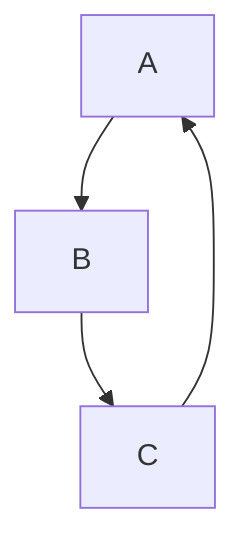
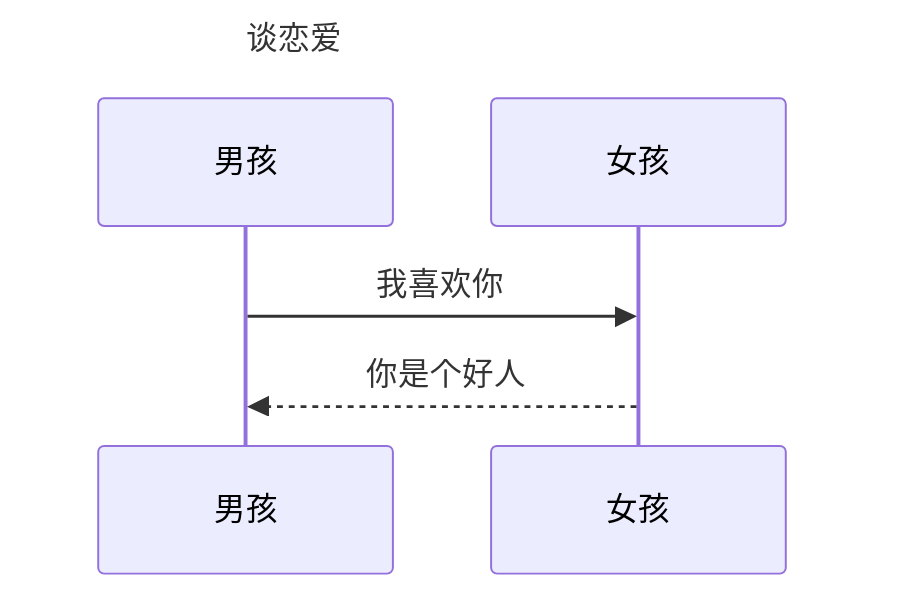
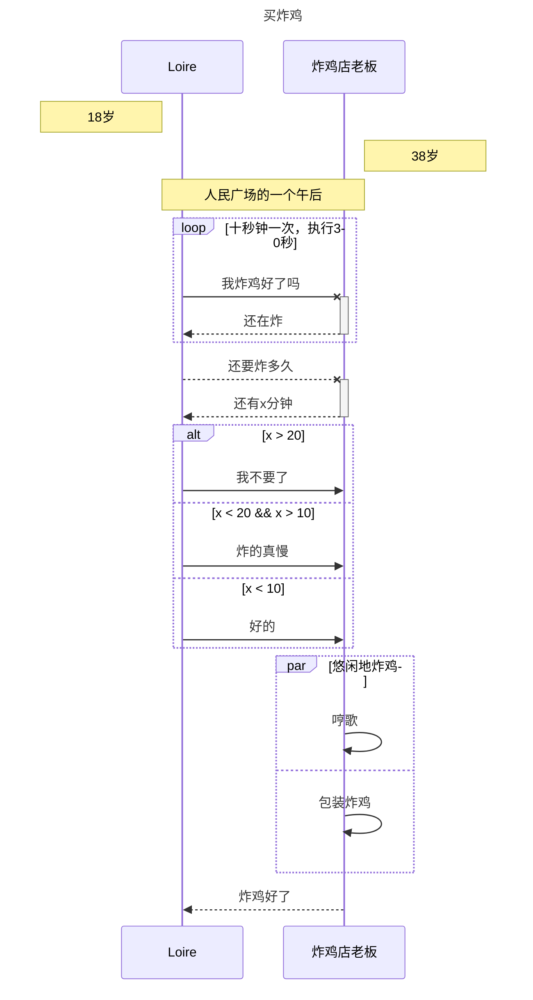
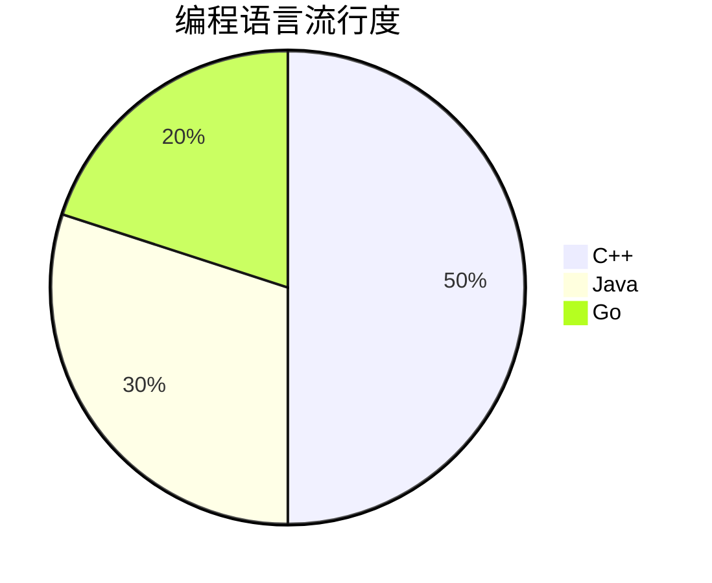
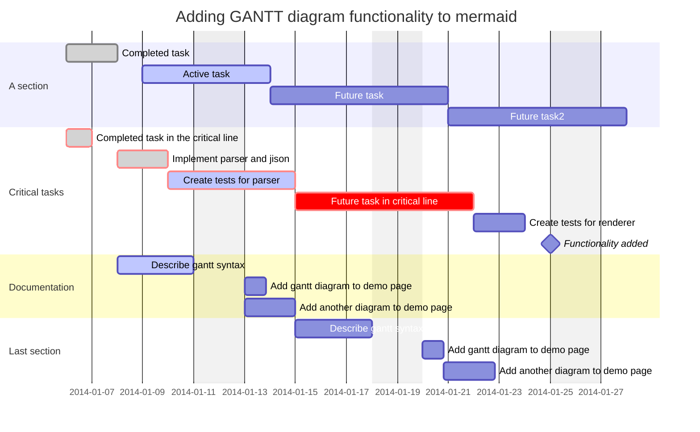

# <span style="font-size:0.8em;">Markdown语法总结</span>

前置声明：以下大部分语法在Typora中都可以通过右键找到对应的快捷插件，学习语法一方面是方便我们灵活编辑md文本，无须反复腾出手去滑动点击鼠标，一方面是为了在一般的编辑器里也能正确编写md文件。

## 标题

```markdown
# 一级标题  
## 二级标题  
### 三级标题  
#### 四级标题  
##### 五级标题  
###### 六级标题  

PS：在#后面要添加一个空格再跟标题内容
```

## 段落与换行

1. 普通换行需要在换行处添加两个空格，如：


```markdown
这里是第一行（随后跟两个空格 + “enter”，再打出下一行内容即可）  
这里是第二行
```

2. 换段落（行与行之间多一空白行）：


```markdown
这里是第一段（随后连续打出两个回车enter）

这里是第二段
```

PS：上述规则应该适用于一般的文本编辑器里编写markdown文件的情况。

但是不同编辑器/网页由于使用的渲染器不同，实际展现出来的效果也可能有所差异。比如本人在使用Typora1.8.10版本时发现一个enter就会被实时渲染成换段落，即使使用两个空格再enter也会直接被渲染为换段落。

因此建议确实需要换行功能的博主，**进入源代码模式**编写markdown文档，便于使用原始版本的语法而不会被Typora渲染器的不同效果影响。如果觉得换行和换段落区别不大，也可以直接按照Typora的特性来——统一使用一个enter换段落的方式开启新的一段内容。

## 文本效果：加粗与斜体与中划线

**在一段文本的起始和终止位置分别添加两个星号，如本行文字即是在编辑器中如此操作后的加粗效果。**

```markdown
**在一段文本的起始位置和终止位置分别添加两个星号**
或者
__使用下划线也可以实现相同的效果__
```

*斜体方式与文本加粗同理，但改为使用一个星号或一个下划线。*

```markdown
*这是一行斜体文字*
_这也是一行斜体_
```

~~中划线（删除线）则使用两个波浪号~~

```markdown
~~这是一行删除线文字~~
```

~~***如果要实现同时加粗和斜体和中划线，则将星号或者下划线的数量改成三个，再外加两个波浪号即可（叠加原理）***~~

## 段落间分割线

三个及以上的星号*或者下划线_即可

****

如此处所示

```markdown
天青色等烟雨
____(或者****) 
而我在等你
```

## 列表编写

### 无序列表

* 列表的符号是*或者+或者-（后面加一个空格再接文本） 
* 一般编辑器中，同一个列表（每一项紧邻）的每一项前面添加的列表符号必须相同，否则会被渲染成两个不同的列表（间隔较大）
* Typora中，同一列表里一项末尾直接enter可以产生下一项，再次enter会消除自动添加的列表格式。使用不同的列表符号也不会有换列表效果，只能再加一个enter手动产生行距再添加新列表。（有序列表同理）

```markdown
* 第一项任务
* 第二项任务
* 第三项任务

- 另一个列表第一项

+ 这又是一个新的列表
```

### 有序列表

1. 列表第一项用“数字 + . +空格”
2. 后续换行就会自动产生第二项
3. 顺序是由列表第一项决定的，后面每一项的序号都自动递增。

### 列表嵌套

- 一级列表下直接编写文本的方法：enter换行+回车，再编写文本即可。

- 在一级列表里嵌套二级列表的方式：在一级列表的某一项后换行，回车删除自动添加的一级序号，再用“数字 + . + 空格”或者“* + 空格”，即可实现该项下创建二级有序或无序列表（后面介绍的复选框列表也可以这样嵌套）。

- 若要跳出二级列表循环，重新创建上一级列表的下一项，则连续按下三次enter即可（连续两次是消除二级列表格式，直接在一级列表的该项下编写普通文本，编写文本后需要再连续按两次enter才能跳出一级列表的该项，新建一级列表的下一项）

示例：

1. 一级列表第一项（然后enter换行+回车，直接在该项下编写文本）

   一级列表下的一段文本。（一个enter+“1 + . + 空格”,继续创建二级有序列表）

   1. 二级列表第一项（一个enter创建同级下一项）

   2. 二级列表第二项（enter换行+回车，直接在该项下编写文本）

      二级列表下编写一段文本。（两次enter消除二级列表下的文本格式，创建二级列表下一项）

   3. 二级列表第三项

2. 一级列表第二项（enter换行+回车+“1 + . + 空格”创建二级列表）

   1. 二级列表第一项（连续三次enter跳出二级列表循环创建一级列表下一项）

3. 一级列表第三项

   1. 二级列表第一项（两次enter消除二级列表格式，直接在一级列表该项下编写文本）

   一级列表下的一段文本。（再连续两次enter跳出一级列表该项，新建一级列表下一项）

4. 一级列表第四项

### 勾选框

* [x] 第一项任务已完成
* [ ] 第二项任务未完成

像这样的勾选框列表如何实现呢？(勾选框是否可勾选和html渲染插件有关)

操作方法是在无序列表符号*后面跟上“空格+[空格填充]+空格”，若[]内用字母x填充则变为选中状态，用空格填充则为非选中状态。

## 代码块

Typora里可以直接右键调用插件插入代码块，一般通用的方法是在需要设置为代码块的段落前一行和后一行分别添加```

第一行```后面跟代码块格式（c++，java等）

如下所示

````markdown
```c++(在```后面跟代码块格式)
代码段落
代码段落
代码段落
```
````

如果要在行内插入小代码块`小代码块`，则在要设为小代码块的内容前后分别添加`

如下所示

````markdown
这是一行`markdown`代码块。
````

小代码块的使用场景一般有两种：

1. 需要在行内插入代码辅助解释。
2. 有特殊符号，为保留原文本，避免被解析成某种语法或者链接，可以将其用代码块包裹。

PS：如果需要直接插入网页URL，为不被解析为其他符号且能点击跳转，同时避免URL后的文本也被解析为链接的一部分，可以使用`<>`符号包裹URL，第一个<表示链接开始，第二个>表示链接结束。

## 引用

在每一行要引用的内容开头加符号>和空格即可

若要嵌套，使用多个`>`符号即可

~~~ markdown
> 这是一段引用的文本，来自某公众号文章
> - 引用里面也可以嵌套其他格式如列表，代码块和二级引用
> - 引用部分内的其他语法都可嵌套，其他格式内也可以嵌套引用，将符号顺序改一下即可。
- > 比如这里就是在一个列表里插入引用
  >>在引用里嵌套引用
~~~

> 这是一段引用的文本，来自某公众号文章
> - 引用里面也可以嵌套其他格式如列表，代码块和二级引用
> - 引用部分内的其他语法都可嵌套，其他格式内也可以嵌套引用，将符号顺序改一下即可。
- > 比如这里就是在一个列表里插入引用
  > >在引用里嵌套引用

## 超链接

普通超链接使用`[]()`符号，填充规则如下：

```txt
[要跳转的目标名称，如我的个人网站](网站域名)
示例：
[我的博客](ccloire.com)
之后就会渲染为一行可点击跳转的加粗“我的博客”文本，点击即可跳转到ccloire.com网站
```

域名分离超链接：

若域名太长且多处需要调用网页超链接，则为了编写时更加简洁高效，也可以采用重命名的方式

```txt
[我的博客][a]里面有我的个人技术文章，欢迎大家光临，也可以去[代码随想录][b]里查找算法练习。
别名还可以反复使用，如[柯北的技术博客][a]渲染后也是跳转到https://ccloire.com的超链接

[a]: https://ccloire.com
[b]: https://algorithm.com
```


## 脚注

感兴趣的读者可以前往我的个人网站[^1]

[^1]: 网站有两个<https://ccloire.com>或<https://ccloire2.com>

像这样给一段文本加注释角标，鼠标点击时跳转注释（若有网页链接也可以直接点击跳转）的方式如下：

```txt
个人网站[^1],第二个脚注[^2]

[^1]:网站有两个https://ccloire.com或https://ccloire2.com
[^2]:随便什么内容
```

## 插入图像


- 常规语法：

  像这样插入图片的常规语法是``，图片路径可以是本地路径---但只能在本机访问该图片；也可以是URL链接指向网址中的图片---能联网就能访问。

  

- 快捷方法：

  在Typora中，安装插件即可支持右键选择插入图像功能，自动补充图像语法，用户只需点击文件夹图标在本地选择要上传的图片或者手动输入图片链接即可。插件网盘链接：<https://pan.baidu.com/s/1h19j_es-iW4GVrkmUWIL7g?pwd=3251>，有需要的读者自取，提取码3251。
  也可以扫码领取：

  插件安装方法：将插件文件夹下的plugin文件夹复制粘贴到这个目录下：D:\Program Files\Typora\resources（D:\Program Files是我的Typora安装位置，具体以读者的实际安装位置为准），然后运行`plugin\bin\install_windows_amd_x64.exe`，这个脚本会修改Typora\resources目录下的windows.html文件，使得插件在Typora中正常运行。

  插件使用说明见官网文档：<https://github.com/obgnail/typora_plugin?tab=readme-ov-file#%E6%8F%92%E4%BB%B6%E4%BD%BF%E7%94%A8%E8%AF%B4%E6%98%8E>

  

- 本地图片转化为网页链接的方法---搭建个人图床：详见本站的另一篇文章

  
  
- 图片的缩放---使用HTML语法：

  markdown编辑器一般都支持部分HTML格式，因此我们可以用如下语法来插入图片并调整其大小
  
  ``。
  
  `style`变量指定了图片的大小风格，`src`变量指定了图片的URL链接，`alt`变量指定了渲染后图片下方的注释名称（但不是所有网页和编辑器都会显示这个alt名称）。
  
  PS: Typora插件支持右键直接修改图片缩放比例，将markdown语法转换为HTML语法。

## 插入视频

插入外部网站的视频需要使用HTML语法，常用的方式是`<iframe>`标签，示例如下：

```html
<iframe
        src="https://www.bilibili.com/video/BV1vtoXY9E7v?vd_source=4b639497636747eb9e7ebb76d4d0b7cf"
        style="width: 100%; height: auto; aspect-ratio: 16/9; border: 20px solid black"   #视频格式
        (其中border表示边框样式，aspect-ratio表示视频比例)
        scrolling="no"   #是否允许滚动
        frameborder="yes"   #是否设置边框
        allowfullscreen="true"   #允许全屏播放
        title="bilibili视频"   #视频标题
        ></iframe>
```

以下示例视频展示效果

<iframe 
        src="//player.bilibili.com/player.html?isOutside=true&aid=114087434454472&bvid=BV11RXRYuEdL&cid=28640083971&p=1"
        style="width: 100%; height: auto; aspect-ratio: 16/9; border: 20px solid black" 
        scrolling="no" 
        frameborder="yes" 
        framespacing="0"
        allowfullscreen="true"
        title="bilibili视频"
        ></iframe>


## 插入表格

markdown中添加表格的方式是很形象的，使用`|`和`-`两个符号构成表格的形状即可。

```markdown
|   | 姓名 | 年龄 | 性别 |      
| - | --- | ---- | --- |      
| 1 | 小明 |  18  | 男  |     
| 2 | 小红 |  18  | 女  |                                   
```

“|” 后面接一个空格再跟表头内容，“-”表示表头和项之间的分割线，一个“-”即可正常渲染，使用多个“-”是为了编辑上与表格形状尽量贴近，便于查看。

如果要控制每一列内容的对齐格式，可以在分割线的“-”两边添加“:”

左边添加表示左对齐，右边添加表示右对齐，两边同时添加表示居中。

PS： Typora中的插件也可以实现一键插入表格和一键编辑。

|      | 姓名 | 年龄 | 性别 |
| :--: | :--: | :----: | :----: |
| 1    | 小明 | 18   | 男   |
| 2    | 小红 | 18   | 女   |

## 其他拓展语法：


Typora支持上图展示的几种拓展语法。

对于内联公式，此处展示一些常用的Latex语法：

- 单独一行Latex数学公式用左右各一个`$`包裹，比如`$y = x + 10$`，渲染后就是  $y = x + 10$

- 若要编写一段多行公式，可以在公式段前后添加`$$`，内部使用`\begin{split} A\\B \end{split}`进行换行，`\\`要写在行与行之间，这是因为Mathjax渲染器的局限（无法直接识别单独的`\\`换行）；hexo-filter-mathjax插件会对每个`$$`公式段自动编号。  
  示例如下：

  ```Latex
  $$
  \begin{split}
  y = x + 10
  \\
  y = x - 10
  \end{split}
  $$
  ```

​       渲染后为：
$$
\begin{split}
y = x + 10
\\
y = x - 10
\end{split}
$$

- 分式语法：`\frac{分子}{分母}`，示例：$\frac{1}{10}$

- 上下标：除了上图中`~下标~`和`^上标^`的写法外，还可以直接在内联公式段里使用单独的下划线_表示下标，单独的^表示上标。

  而且Latex语法支持同时使用上下标，如`x_2^{2x}`，渲染后效果:  $x_2^{2x}$

- 开根号：`\sqrt[4]{3}`表示给3开四次根：$\sqrt[4]{3}$ 

  如果要给一串代数式开根，又不想代数式中的某些``{}``符号被解析成语法格式，可以使用转义符`\`，如`$\sqrt[4]{\{(4+x) - 3\}}$`，渲染后为：$\sqrt[4]{\{4+x)-3\}}$

- 常见数学符号：

  1. 不等于：`\not=`    $\not=$
  2. 与等于：`\approx`    $\approx$
  3. 小于等于：`\leq`    $\leq$
  4. 大于等于：`\geq`    $\geq$
  5. 乘号：`\times`    $\times$
  6. 除号：`\div`或者`\textdiv`    $\div$
  7. 正负号：`\pm`     $\pm$
  8. 求和符号(配合上下标)：`\sum^2_2`    $\sum^2_2$
  9. 累乘：`\prod`    $\prod$
  10. 度数： `90^\circ`    $90^\circ$
  11. 三角函数：`\sin\pi`    $\sin\pi$   其余同理
  12. 无穷：`\infty`    $\infty$
  13. 定积分：`\int^b_ax^2dx`    $\int^b_ax^2dx$   (PS： n重积分就用n个i，如三重积分`\iiint`$\iiint$)
  14. 求导符号：`y\prime`   $y\prime$
  15. 元素属于/不属于集合：`x\in A`以及`x\notin A`    $x\in A$  以及  $x\notin A$
  16. 极限：`\lim_{n\rightarrow+\infty}\frac{1}{n}`    $\lim_{n\rightarrow+\infty}\frac{1}{n}$​
  17. 省略号：`\frac{1}{2}+\frac{1}{3}+\cdots+\frac{1}{n}`     $\frac{1}{2}+\frac{1}{3}+\cdots+\frac{1}{n}$​


更多markdown中编写Latex语法的内容可以查看[莱斯大学Latex Math在线手册](https://www.cmor-faculty.rice.edu/~heinken/latex/symbols.pdf)

还可以翻阅一位up的帖子，介绍的也很全面[来自李东的知乎帖子](https://zhuanlan.zhihu.com/p/59412540)。

## 使用内置的mermaid插件画图

markdown格式支持对使用mermaid绘制的图表进行渲染，只要在markdown编辑器中安装mermaid拓展插件即可。Typora本身就集成了mermaid环境，因此可以直接在代码块中声明语法为mermaid并进行绘图。

> PS： mermaid最新版目前已经更新到11.6以后了，而各大markdown编辑器如Typora不一定有对最新版mermaid插件的支持。且某些Typora破解版也只能激活旧版本，对mermaid插件支持也比较低级。故实际使用时有些mermaid语法可能无法正常渲染，读者有需要可以去[mermaid官网](https://mermaid.js.org/)使用最新版本，官网内也附带非常详细的[mermaid部署，语法以及配置教程](https://mermaid.js.org/ecosystem/tutorials.html)。
>
> 
>
> 对于写博客的同志，有可能你的博客配置进行了最新版本mermaid的部署（比如我使用的是hexo-theme-butterfly，主题适配了11.4.1版本的mermaid），这种情况你可以在Typora里用源代码模式编写mermaid，以实际博客网站渲染出来的效果为准。当然如果你更习惯Typora这种即使渲染的效果，且想以Typora里的编辑为准，那就只能接受一些版本局限。

下面介绍一些常用且通用的mermaid基础语法。

### 流程图

Typora中集成了两种绘制流程图的插件，一个就是mermaid，另一个是较为简单的flow（只能绘制流程图）

下面介绍这两种插件绘制流程图的方法（在代码块中声明语法为mermaid或flow）：

#### flow插件绘制

```flow
st=>start: 开始
on=>operation: 执行内容
cn=>condition: 执行是否成功
en=>end: 结束
st->on
on->cn(yes)->en
cn(no)->on
```

```markdown
st=>start: 开始     //st表示结点命名，“=>start: 开始”表示指结点类型和填充内容
on=>operation: 执行内容
cn=>condition: 执行是否成功
en=>end: 结束
st->on        //"->"表示结点之间的有向线段
on->cn(yes)->en      //condition类结点可以指定条件为"yes" or "no"
cn(no)->on
```

#### mermaid插件绘制

```markdown
graph TB;
  A-->B
  B-->C
  C-->A
%% mermaid注释内容（%%注释不会被识别为图表语法）
```




语法简析：

- graph表示流程图的开始，TB表示箭头方向从上到下，A-->B表示A结点指向B结点。

  结点没有声明类型和内容时默认为矩形结点，并以编号填充。

- 其他的箭头方向还有：

| 用词 | 含义     |
| ---- | -------- |
| TB   | 从上到下 |
| BT   | 从下到上 |
| RL   | 从右到左 |
| LR   | 从左到右 |

- 下面是mermaid流程图常见的符号及含义：

| 用词                | 说明           | 含义                                                   |
| ------------------- | -------------- | :----------------------------------------------------- |
| node_id[结点内容]   | 矩形结点       | 表示过程，即流程中的某个环节                           |
| node_id(结点内容)   | 圆角矩形结点   | 表示开始或结束                                         |
| node_id((结点内容)) | 圆形结点       | 表示链接，用于流程过长或有交叉的情形，将流程分成两部分 |
| node_id{结点内容}   | 菱形结点       | 表示条件判断或决策                                     |
| node_id>结点内容]   | 右向旗帜状结点 |                                                        |


- 下面是常见的连线类型：

  ```markdown
  graph TB
    A1-->B1
    A2---B2
    A3--text---B3
    A4--text-->B4
    A5-.-B5
    A6-.->B6
    A7-.text.-B7
    A8-.text.->B8
    A9===B9
    A10==>B10
    A11==text===B11
    A12==text==>B12
  ```

  ```mermaid
  graph TB
    A1-->B1
    A2---B2
    A3--text---B3
    A4--text-->B4
    A5-.-B5
    A6-.->B6
    A7-.text.-B7
    A8-.text.->B8
    A9===B9
    A10==>B10
    A11==text===B11
    A12==text==>B12
  ```

- 子图表的绘制：

  mermaid画流程图可以在一个图表里嵌套子图表，来实现独立模块的划分。

  子图表的箭头方向可以单独指定，但如果子图表的结点和外部产生链接，则子图表的箭头方向会失效，取而代之的是继承父类图表的方向。

  示例：

  ```markdown
  graph TB
  	subgraph 子图表-工作流 
  		direction LR
  	    begin(打开电脑)-->work[敲代码干活]
  	end
  	stop{休息会}
  	work-->temp{干活满45分钟没}-->|no| work
  	temp -->|yes| stop-->|休息满10分钟| work
  	stop-->|没满十分钟| stop
  ```

  ```mermaid
  graph TB
  	subgraph 子图表-工作流 
  		direction LR
  	    begin(打开电脑)-->work[敲代码干活]
  	end
  	stop{休息会}
  	work-->temp{干活满45分钟没}-->|no| work
  	temp -->|yes| stop-->|休息满10分钟| work
  	stop-->|没满十分钟| stop
  ```

### 序列图

示例：

```markdown
sequenceDiagram
	Title: 谈恋爱
	男孩->>女孩: 我喜欢你
	女孩-->>男孩: 你是个好人
```



语法解析：

#### 参与者：

参与者表示序列图中一切可以交互的事物，可以是人，类对象或系统。而每个参与者上下之间的竖线表示时间的流逝。

声明参与者的语法为：

```markdown
sequenceDiagram
    participant 参与者1
    participant 参与者2
    ...
    participant 简称 as 参与者n  //此写法可以在后文用简称代替“参与者n”
```

#### 消息线

| 类型 | 描述                          |
| ---- | ----------------------------- |
| ->   | 无箭头的实线                  |
| -->  | 无箭头的虚线                  |
| ->>  | 带箭头的实线                  |
| -->> | 带箭头的虚线                  |
| -x   | 末端为x的实线（表示异步执行） |
| --x  | 末端为x的虚线（表示异步执行） |

#### 处理中—激活框

在参与者的时间线上标记一个激活框，表示对某一条消息进行处理的时间间隔

在消息线末尾，消息接收方前添加一个“+”，则消息接收者进入对该消息的“处理中”状态。

在消息线末尾，消息接收方前添加一个“-”，则消息接收者离开对该消息的“处理中”状态。

#### 注释

注释格式为：`Note 位置表述 参与者: 注释内容`

位置表述有：

- right of ：右侧
- left of ：左侧
- over ：横跨在多个参与者之中

#### 循环

满足一定条件时，重复发出消息序列。

```markdown
loop 执行条件
	要执行的消息序列
end
```

#### 选择

类似else-if这样的条件判断语句：

```markdown
alt 条件1
	执行语句1
else 条件2
	执行语句2
else 条件3
	执行语句3
end
```

#### 并行

par并行序列表示多个动作同时进行：

```markdown
par 并行序列名称
	执行语句1
and 
	执行语句2
end
```

示例：

```markdown
sequenceDiagram
	Title: 买炸鸡
	participant A as Loire
	participant B as 炸鸡店老板
	Note left of A: 18岁
	Note right of B: 38岁
	Note over A,B: 人民广场的一个午后
	loop 十秒钟一次，执行30秒
		A -x +B: 我炸鸡好了吗
		B -->> -A: 还在炸
	end
	A --x +B: 还要炸多久
	B -->> -A: 还有x分钟
	alt x > 20
		A ->> B: 我不要了
	else x < 20 && x > 10
		A ->> B: 炸的真慢
	else x < 10
		A ->> B: 好的
	end
	par 悠闲地炸鸡
		B ->> B: 哼歌
	and 
		B ->> B: 包装炸鸡
	end
	B -->> A: 炸鸡好了
```



### 饼图

```markdown
pie    //声明饼图
	title 编程语言流行度   //饼图标题
	"C++" : 200    //组成部分以及其数量（最多支持两位小数）
	"Java" : 120
	"Go" : 80
```



### 甘特图

甘特图的基本构成如下：

```markdown
gantt   //声明甘特图
	title 标题
	dataFormat 日期格式（指甘特图下方时间线的日期格式，一般用YYYY-MM-DD）
    excludes 不工作的时间段
    
    section 任务名
    任务名: 参数1，参数2，参数3，参数4，参数5，参数6
```

- excludes: 后跟具体日期（2025-01-01）、星期（sunday）、周末（weekends）或前三个日期格式的组合，表示该日期期间不安排工作。比如某个任务开始时间是周五，持续3天，而excludes限定周末不工作，则任务将持续到下周二才完成。

- 参数1：填crit表示重要事件（红色框效果）或者milestone不填。
- 参数2：done(已完成，灰色效果)、active(正在进行，浅蓝色效果)、不填（待完成状态，深蓝色效果）。
- 参数3：milestone(表示里程碑事件；菱形效果；若任务被声明为里程碑，持续时间应该设为0d，或者开始和结束在同一天)、不填。
- 参数4：别名或者不填。
- 参数5：任务开始时间，可以是具体日期(YYYY-MM-DD)，也可以是after  task(task为同一个section里的其他任务名或者其别名)。
- 参数6：任务结束时间，可以是具体结束日期，也可以是从开始时间算起的持续时间(如3d，20h)。
- PS：参数5和参数6是必填的，但是也可以两个参数统一一个参量表示(如3d，20h)，表示默认从上一个任务的结束时间开始，持续多长时间。

甘特图示例如下：

```markdown
gantt
    dateFormat  YYYY-MM-DD
    title       Adding GANTT diagram functionality to mermaid
    excludes    weekends

    section A section
    Completed task            :done,    des1, 2014-01-06,2014-01-08   
    %% 以上任务的参数没有出现crit，说明第一个参数不填，不是重要任务；done表示已完成，des1表示别名，后面是开始和结束时间
    Active task               :active,  des2, 2014-01-09, 3d
    Future task               :         des3, after des2, 5d
    %% 前两个参数不填，表示待完成；after des2表示在Active task结束后开始，5d表示持续5天
    Future task2              :         des4, after des3, 5d

    section Critical tasks
    Completed task in the critical line :crit, done, 2014-01-06,24h
    Implement parser and jison          :crit, done, after des1, 2d
    Create tests for parser             :crit, active, 3d
    Future task in critical line        :crit, 5d
    %% 时间参数只有5d，表示默认从“Create tests for parser”任务的结束时间开始，持续5天
    Create tests for renderer           :2d
    Functionality added                 :milestone, isadded, 2014-01-25, 0d
    %% 里程碑事件，起始时间+0d表示一天内发生

    section Documentation
    Describe gantt syntax               :active, a1, after des1, 3d
    Add gantt diagram to demo page      :after a1  , 20h
    Add another diagram to demo page    :doc1, after a1  , 48h

    section Last section
    Describe gantt syntax               :after doc1, 3d
    Add gantt diagram to demo page      :20h
    Add another diagram to demo page    :48h

```




